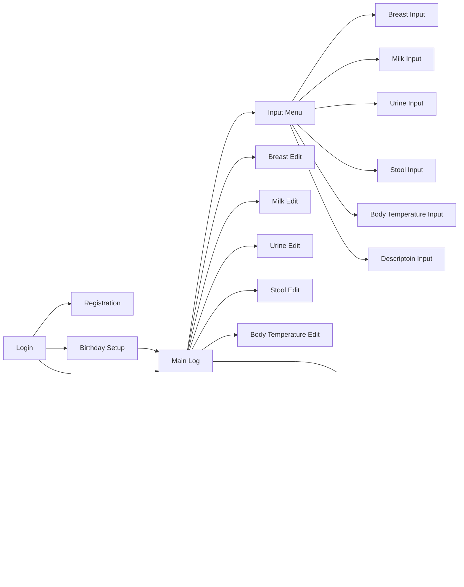

# BabyApp

## About

Babyapp is an application designed to manage records of activities like feeding and diaper changes for babies. The paper formats provided by maternity wards for record-keeping posed challenges, including limited space for writing, the difficulty of writing in dimly lit conditions at night, and the possibility of forgetting to record due to a busy schedule. To address these issues and as a personal portfolio project, I developed this service. The features incorporated into the app are ones that I personally needed, and whether they would be equally appealing to others is questionable. However, I personally am quite fond of these features.

## Service URL

We have implemented a demo interface with sample data so you can try it out without registration.

<https://babyapp.jp/>

## Screen transition diagram

## Ruby version

- v3.2.2

## System dependencies

- ruby
  - bundler
- build-essential
- default-libmysqlclient-dev
- git
- libvips
- pkg-config
- curl
- default-mysql-client
- libvips

## Configuration

## Database creation

  `bin/rails db:create`

## Database initialization

  `bin/rails db:prepare`

## How to run the test suite

  `bundle exec rspec`

## Services (job queues, cache servers, search engines, etc.)

## Develpment Setup instructions

## Deployment instructions

## List of Features

- [x] Automatic day-night switching
- [x] Contact book support
- [x] Moon age display
- [x] Body temperature graph screen
- [x] Switch between weekly, 3-day, and daily views
- [x] Default settings screen
- [x] Breast milk formula aggregation
- [x] Synchronization
- [x] Stress-free slider input
- [x] Notes popup preview
- [x] Demo screen implementation
- [x] Time navigation using button taps
- [x] Position memory for re-display
- [x] Edit undo

## Technical Specifications

- Ruby 3.2.2
- Ruby on Rails 7.1.1
- RSpec 3.12
- Rubocop
- Devise
- RubySunrise
- Ransack
- MySQL 8
- SQLite 3
- Webpack
- Chart.js
- Bootstrap 5
- FontAwesome

## Technology Stack

| Category          | Technology Stack                                     |
| ----------------- | --------------------------------------------------   |
| Frontend          | html, css(Bootstrap5), js(chart.js, jQuery)                       |
| Backend           | Ruby On Rails                           |
| Infrastructure    | Self-hosted server, nginx, DDNS                         |
| Database          | MySql                                           |
| Monitoring        |                                   |
| Environment setup | Docker                                               |
| CI/CD             |                                        |
| Design            |                                          |
| etc.              | Rubocop, Git, Git flow, GitHub |

## Future Outlook

- [ ] Consider rebuilding in the Rails 7 series
- [ ] Daily builds to keep up with library updates
- [ ] Transition the frontend to React
- [ ] Transform into microservices and set up a DevOps environment using Kubernetes
- [ ] Calculate day-night based on the input of the residential area
- [ ] Implement synchronization using ActionCable
- [x] Implement bulk insert
- [ ] List and preview photos, files (PDF, .txt, .png, .jpeg, movies, etc.)
- [ ] Support embedded URLs
- [ ] Display and notify vaccine schedules
